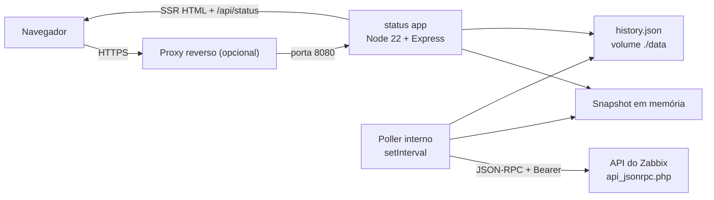
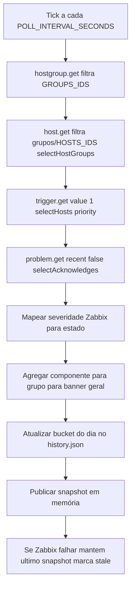

# Arquitetura e Fluxo

## Arquitetura

Um único serviço Node roda um servidor HTTP e um poller em background. O poller consulta a
API JSON-RPC do Zabbix, monta um snapshot, mantém-no em memória e persiste um histórico de
uptime (janela rolante) num arquivo JSON num volume. O servidor renderiza a página (SSR) e
expõe um endpoint JSON e um health check.

## Fluxo

A cada tick, o poller busca o estado atual no Zabbix, mapeia severidades para estados de
componente, agrega por host group, atualiza o bucket do dia no histórico e publica o
snapshot. Em caso de falha, mantém o snapshot anterior e marca a página como desatualizada.

